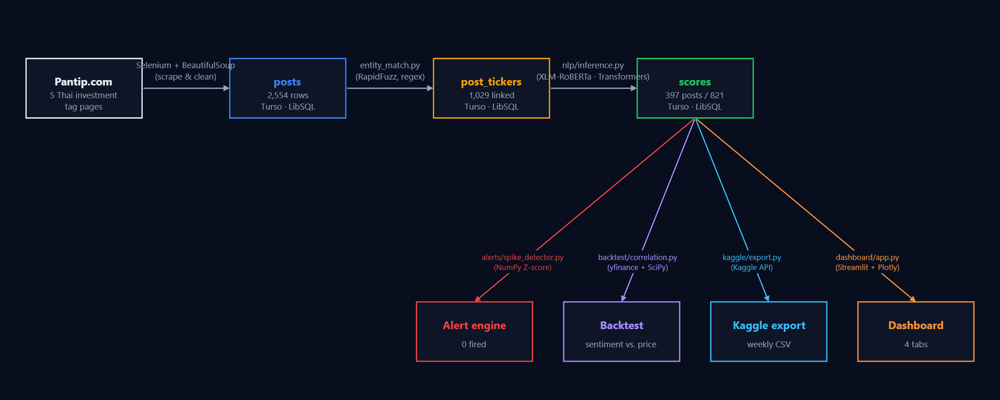
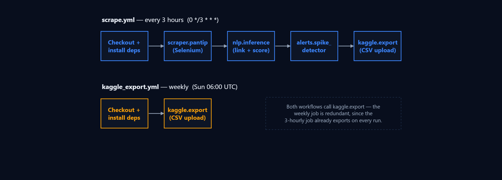
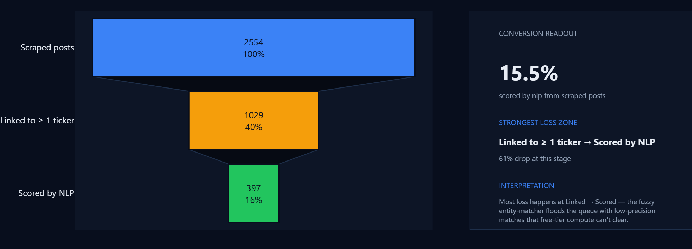
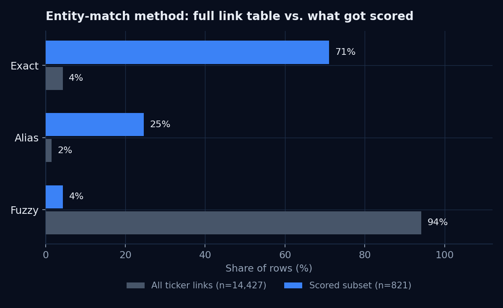
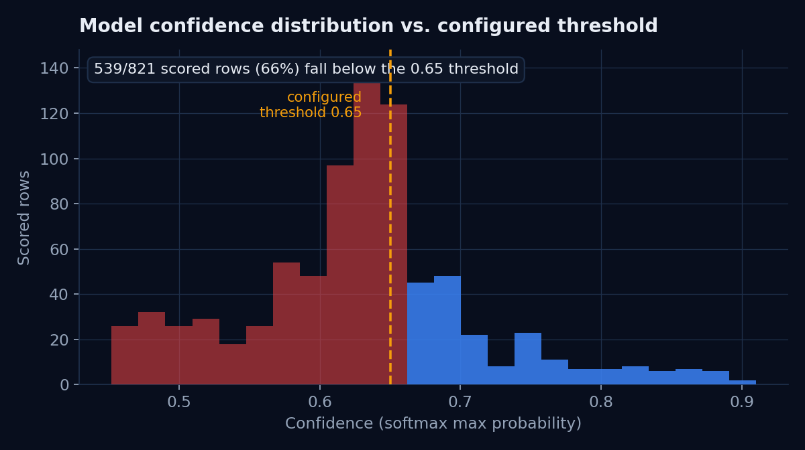
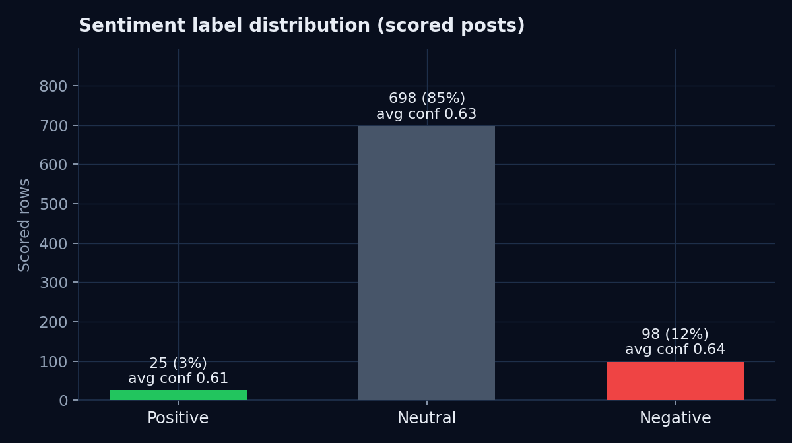
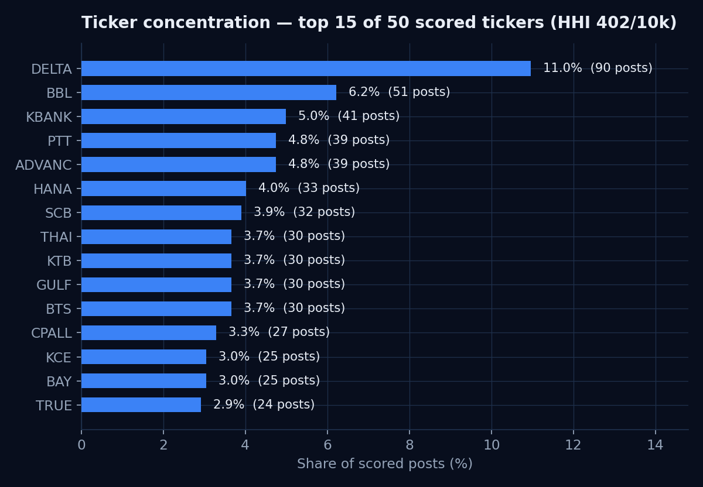
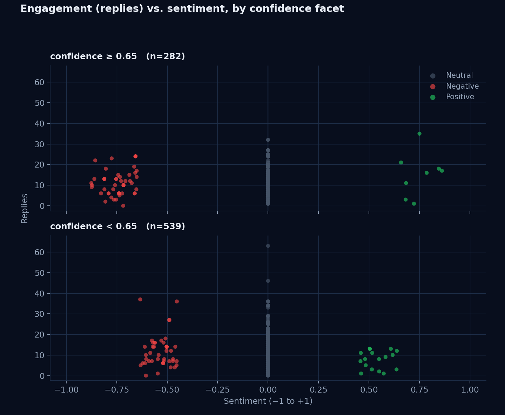
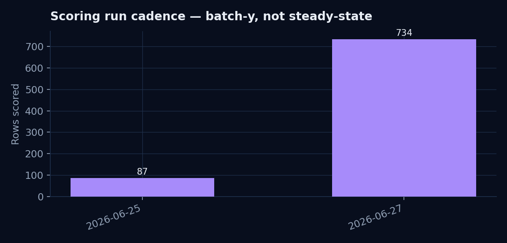

# Pantip SET Sentiment Monitor

Thai-language sentiment monitoring for SET-listed companies, mined from retail-investor discussion on [Pantip.com](https://pantip.com) — Thailand's largest public web forum. The pipeline scrapes discussion threads, links them to stock tickers, scores sentiment with a multilingual transformer, and surfaces the result through a live Streamlit dashboard. Built entirely on free-tier infrastructure.

This README is also the project's analysis report: every number and chart below is generated directly from the production database (see [`scripts/generate_readme_charts.py`](scripts/generate_readme_charts.py)), not invented for presentation. Where the data turned out messier than expected, that's documented too — see [Problems Encountered](#problems-encountered) and [Limitations](#limitations).

> **Live analysis tab.** The dashboard's **📚 Documentation & Analysis** tab reproduces the charts in this README as live, auto-refreshing queries — useful for checking whether a finding still holds after the next scrape/score cycle.

---

## Table of contents

- [Architecture](#architecture)
- [Pipeline approach](#pipeline-approach)
- [Data collection](#data-collection)
- [Problems encountered](#problems-encountered)
- [Analysis: what the data actually shows](#analysis-what-the-data-actually-shows)
- [Limitations](#limitations)
- [Business questions answered](#business-questions-answered)
- [Quick start](#quick-start)
- [Project structure](#project-structure)
- [Configuration reference](#configuration-reference)
- [Running tests](#running-tests)
- [Roadmap](#roadmap)

---

## Architecture

| Layer | Platform | Free limit | Role |
|---|---|---|---|
| Cron / backend | GitHub Actions | 2,000 min/month | Scraper + entity-link + NLP + alerts pipeline |
| Database | Turso (LibSQL) | 500 MB, 1B reads/month | Cloud SQLite, accessed via HTTP pipeline API |
| Frontend | Streamlit Community Cloud | Unlimited public apps | Dashboard |
| Price data | yfinance | Free | SET ticker OHLCV for backtesting |
| Data publishing | Kaggle Datasets | 20 GB | Weekly-exported scored-posts CSV |

Every layer runs on a free tier by design — the tradeoff for that (a CPU-only, time-boxed compute budget) is the main driver behind several findings in the [analysis](#analysis-what-the-data-actually-shows) section below.

### Data flow diagram

Live row counts at every stage — regenerated straight from the production database (also reproduced live in the dashboard's **Documentation & Analysis** tab):



### Automation pipeline

Two independently-scheduled GitHub Actions workflows. `scrape.yml` runs the whole scrape → link → score → alert → export chain sequentially every 3 hours; `kaggle_export.yml` runs just the export step weekly — currently redundant, since the 3-hourly job already exports on every run (see [Roadmap](#roadmap)):



---

## Pipeline approach

**1. Scraping** ([`scraper/pantip.py`](scraper/pantip.py)). Selenium drives headless Chrome across five Thai investment-related tag pages (`/tag/หุ้น`, `/tag/ลงทุน`, `/tag/กองทุน`, `/tag/ตลาดหลักทรัพย์`, `/tag/SET`), scrolling each listing to lazy-load more threads, then visits each new topic page to extract title, body (truncated to 2,000 chars), reply count, and post timestamp. A circuit breaker pauses 60s after 3 consecutive failures, and the driver is recreated if the ChromeDriver connection itself dies. Known-seen `post_id`s are skipped so each run only processes new threads.

**2. Entity linking** ([`nlp/entity_match.py`](nlp/entity_match.py)). Every unlinked post is matched against all 50 tracked tickers in four passes, in priority order: exact ticker symbol (confidence 1.0) → exact company name (0.95) → curated Thai alias dictionary (0.90) → RapidFuzz `partial_ratio` fuzzy match (≥ 85, scored as ratio/100). Short tickers (≤ 3 characters, e.g. `AOT`, `CPF`) require co-occurrence with a finance keyword (หุ้น, ลงทุน, ราคา, …) to suppress false positives from common Thai words that happen to collide with a ticker symbol.

**3. Sentiment scoring** ([`nlp/inference.py`](nlp/inference.py)). `cardiffnlp/twitter-xlm-roberta-base-sentiment` — a multilingual XLM-RoBERTa fine-tuned on Twitter sentiment across 30+ languages including Thai — runs batched inference (batch size 16) on `title + body`. Predictions below a configurable confidence threshold (`SENTIMENT_CONFIDENCE_THRESHOLD`, default 0.65) are discarded rather than stored. Continuous sentiment is derived as `+confidence` for positive, `−confidence` for negative, `0.0` for neutral, giving a `[-1, 1]` score rather than a flat three-bucket label.

> The README and `.env.example` originally described a planned WangchanBERTa fine-tune (`models/wangchanberta_finetuned.pt`) as the model in use. It isn't — that path is checked and loaded *if present*, but no fine-tuning has happened yet, so every score in production comes from the off-the-shelf Cardiff NLP checkpoint. This README now reflects what's actually running.

**4. Alerting** ([`alerts/spike_detector.py`](alerts/spike_detector.py)). Two rules, evaluated per ticker with 3 bulk queries total (not one query per ticker): a rolling Z-score on the daily negative-sentiment ratio (fires at Z ≥ 2.5 over a 7-day lookback), and a volume-surge ratio (fires when today's post count exceeds 3× the 7-day average). Firing is deduplicated against unresolved open alerts.

**5. Backtesting** ([`backtest/correlation.py`](backtest/correlation.py)). Pearson and Spearman correlation between daily mean sentiment and `return_1d` (log return) at lags 0–5 trading days, per ticker, using price history pulled from `yfinance`. Built and tested but **not yet wired into the dashboard** — see [Roadmap](#roadmap).

**6. Dashboard** ([`dashboard/app.py`](dashboard/app.py)). Streamlit, dark theme, three operational tabs (Market Overview, Compare Tickers, Posts & Alerts) plus the new **Documentation & Analysis** tab. All dashboard queries filter on `scored_at`, not `posted_at` — see [Limitations](#limitations) for why.

---

## Data collection

- **Coverage window.** The live scraper only walks current tag-listing pages, which surface recent and currently-trending threads — it is not a historical crawl. A one-time backfill ([`scripts/backfill.py`](scripts/backfill.py)) scrolled the same five boards 30× deep (vs. 5× in normal runs) to pull a denser recent slice. The result: of 2,542 scraped posts, 818 fall between Sep 2025 and Jun 2026, and only **3 posts predate 2025** (2015-05-29, 2015-07-08, 2018-11-17) — old, evergreen threads that happened to resurface in a tag listing. **This is not a clean multi-year time series**; treat anything before ~Sep 2025 as sparse, incidental coverage, not systematic history.
- **Cadence.** GitHub Actions cron fires every 3 hours (`0 */3 * * *`), budget-permitting (2,000 free minutes/month).
- **Rate limiting.** 2–5s randomized delay between requests, plus the circuit breaker described above. This is a respectful-citizen scraper, not a high-throughput crawler.
- **Reply counts** are sourced two different ways depending on the code path, which is itself one of the findings below: the live Selenium scraper reads static HTML heuristically; the one-time backfill/update scripts call Pantip's internal AJAX endpoint directly. See [Problems Encountered](#problems-encountered).

---

## Problems encountered

A working log of the non-obvious issues hit while building this, in case any of it saves someone else the debugging time.

**Pantip's view/reply counters are populated by client-side JS, not present in static HTML.** The page ships a JsRender template (`{{:count}} ความคิดเห็น`) that's only filled in after an AJAX call completes in-browser. `requests` + BeautifulSoup never sees the real number — only the literal template string. Initial heuristic HTML parsing (`_parse_stats`, since renamed `_parse_replies`) returns 0 for nearly everything scraped this way.

**Found and reverse-engineered the actual data source.** Reading Pantip's own `jquery.topic-renovate.js` in the browser's Sources panel led to the real endpoint: `GET /forum/topic/render_comments?tid={id}`, which returns `{"count": N, ...}` as JSON — but only when called with `X-Requested-With: XMLHttpRequest` and a `Referer` header; otherwise it silently returns empty HTML. Later, Pantip tightened this further: the endpoint now also requires a live PHP session (`PHPSESSID` + `rlr` cookies), which only get issued after visiting the homepage *then* the topic page in the same `requests.Session()`. The backfill/update scripts now do this warm-up explicitly before calling the endpoint.

**The `views` field was never reliably populated and was removed entirely.** Same root cause as above (JS-rendered, no API equivalent worth the cost of reverse-engineering for a field that wasn't core to the analysis) — dropped from the schema, scraper, all queries, and the dashboard, including a live `ALTER TABLE … DROP COLUMN` against the production database. See `replies`/`views` git history if curious.

**`_parse_datetime` was silently truncating valid timestamps.** An early version did `raw[:len(fmt)]` before `strptime`, intending to trim trailing junk — but this also chopped valid ISO-with-timezone strings down to an unparseable prefix, silently failing on a meaningful fraction of posts. Fixed by removing the truncation and instead trying each candidate format against the *unmodified* string.

**`data-comment` / `data-reply` HTML attributes are comment/reply *IDs*, not counts.** Easy to mistake for stat counters since they're plausible-looking integers on the right kind of element — including them in the “extract a number from this attribute” heuristic silently corrupted reply counts. Excluded explicitly once recognized.

**ChromeDriver hangs indefinitely on some pages.** No timeout was set on `driver.get()`, so a single bad page load could hang the whole scraper run until GitHub Actions' job-level timeout killed it. Fixed with an explicit 30s `set_page_load_timeout`, broad exception handling around each page fetch, and driver recreation on connection failure — partial progress now survives a bad page instead of losing the whole run.

**`get_client()` was reconnecting to Turso on every single row during the historical backfill.** Each reconnect costs ~5s; across ~2,500 historical posts that's hours of pure connection overhead. Fixed by opening one `TursoClient` for the life of the backfill run instead of one per post.

**The reply-count fix above only patched the *backfill/update* path — the live scraper still doesn't use the AJAX endpoint.** This is a currently-open inconsistency, not a fixed one: see the first item in [Limitations](#limitations) for the concrete data-quality consequence.

---

## Analysis: what the data actually shows

Generated from the live production database (821 scored `post × ticker` rows, 50 tracked tickers, 2,542 scraped posts) via [`scripts/generate_readme_charts.py`](scripts/generate_readme_charts.py). Re-run that script any time to refresh both the numbers below and the PNGs in `docs/charts/`.

### 1. The pipeline loses 84% of posts before they ever get scored



2,542 posts scraped → 1,017 (40%) matched to at least one ticker → only **397 (16%)** have a sentiment score. That gap between "linked" and "scored" is the headline finding of this whole analysis, and it isn't a confidence-threshold artifact — it's an entity-matching artifact (next finding).

### 2. The entity matcher's fuzzy stage is over-triggering by roughly two orders of magnitude



Across **all** `post_tickers` rows (14,151 of them), **94% are `fuzzy` matches** — only 4.4% exact and 1.5% alias. But the *scored* subset is the inverse: 71% exact, 25% alias, just 4% fuzzy. Digging into why: 610 distinct posts have at least one fuzzy match, but those 610 posts account for 13,308 fuzzy rows — an average of **~22 fuzzy ticker matches per post**, and the 12 most-matched tickers each fuzzy-match 577–580 times out of those 610 posts (i.e. nearly every tracked ticker "matches" nearly every fuzzy-eligible post). 99.7% of fuzzy matches sit at the maximum possible confidence (1.00), which is itself suspicious — a noisy-but-real signal should spread out near the 85-threshold floor, not pile up at the ceiling.

**Root cause:** `rapidfuzz.fuzz.partial_ratio` finds the best-aligned substring of length equal to the *shorter* string and scores it — for short Thai company-name aliases (≥ 4 characters allowed) searched against long, space-free Thai post bodies, it's close to guaranteed to find *some* near-perfect alignment window purely by chance. This single matching stage is responsible for almost the entire scoring backlog: GitHub Actions' free CPU-only compute budget cannot realistically clear a 13,330-row backlog that's 94% low-precision noise, so genuine high-confidence matches (exact/alias) get scored first and the fuzzy tail never catches up. The scoring cadence chart below shows this isn't a steady-state pipeline — it's catch-up bursts.

### 3. A third of historical scores were written below the model's own confidence threshold



`SENTIMENT_CONFIDENCE_THRESHOLD` defaults to 0.65 in both the code and `.env.example`, and the threshold check (`if confidence < CONFIDENCE_THRESHOLD: discard`) is unconditional in `nlp/inference.py` today. Yet **539 of 821 scored rows (66%) have confidence below 0.65** — minimum observed is 0.452. The most likely explanation is that a meaningful slice of these rows were scored before the threshold guard existed in its current form (the one-time backfill in particular). It's flagged here rather than silently fixed because re-scoring or purging those 539 rows is a real decision with tradeoffs (smaller but cleaner dataset vs. larger but noisier) that's worth making deliberately, not as a side effect of a README update.

### 4. Sentiment skews heavily neutral, with low average model confidence even within label



85% of scored posts land neutral, 12% negative, 3% positive — a thread on a public investment forum is more often a question or a factual update than a strongly-worded opinion, which fits priors. More notable: even within each label, mean confidence is only 0.60–0.64 — the model is rarely *very* sure of anything here. That's consistent with a domain mismatch: this checkpoint was fine-tuned on general Twitter text, not Thai financial jargon, slang, or the abbreviation-heavy register typical of a stock discussion board.

### 5. Discussion volume is genuinely diversified across tickers — no single name dominates



DELTA leads at 11.0% of scored posts (90), followed by BBL (6.2%), KBANK (5.0%), PTT and ADVANC (4.8% each) — but the Herfindahl-Hirschman Index across all 50 tickers is **402 out of 10,000**, well inside the "unconcentrated" range (US DOJ guidance treats HHI < 1,500 as unconcentrated). DELTA's lead likely reflects real 2025–2026 retail enthusiasm around the stock rather than a matching artifact, since DELTA appears almost exclusively via exact ticker-symbol matches, not fuzzy.

### 6. Reply count has essentially zero correlation with sentiment or sentiment extremity



Pearson r between `replies` and `sentiment` = **0.013**; between `replies` and `|sentiment|` (how emotionally extreme, regardless of direction) = **−0.045**. Both are indistinguishable from noise at this sample size. The natural hypothesis — "controversial or extreme posts attract more replies" — is not supported by this dataset, in either confidence facet.

Two read-this-correctly notes on the chart itself: the dense vertical strip at `sentiment = 0` is every neutral-labeled post (neutral is hard-coded to exactly `0.0`, not a near-zero range — see `_compute_sentiment` in `nlp/inference.py`), and the visible gap in each facet's x-range (top facet has no points in `(-0.65, 0.65)`; bottom facet has none outside it) is structural, not a finding: `sentiment = ±confidence` by construction, so a confidence-threshold facet mechanically partitions the sentiment axis too. Worth re-checking once the scoring backlog (finding #1) shrinks and n grows well past 821.

### 7. Scoring happens in bursts, not a steady 3-hourly trickle



87 rows scored on 2026-06-25, then 734 on 2026-06-27 — a catch-up run, not the smooth output you'd expect from a job firing every 3 hours. Directly explained by finding #2: most pipeline runs spend their compute budget on (mostly low-quality) backlog rather than finishing it.

### 8. One reply-count value (191,976) on a single post is an obvious parsing artifact

Not chart-worthy on its own, but worth recording: `post_id 44123326` has `replies = 191976` in the live database — no Pantip thread has anywhere near that many comments. It comes from the live scraper's heuristic HTML parsing path (see [Problems Encountered](#problems-encountered) and [Limitations](#limitations) below), not from the AJAX-backed path used by the backfill scripts. It is **not currently linked to any ticker or score**, so it doesn't appear in the dashboard today — but it would if that post is ever matched in a future run.

---

## Limitations

- **Reply counts are sourced inconsistently.** The live Selenium scraper (`scraper/pantip.py`) still extracts `replies` via heuristic HTML/class-name parsing, which is fast but occasionally wrong (see finding #8 above). The backfill/update scripts (`scripts/update_missing_timestamps.py`) instead call Pantip's internal AJAX endpoint after a session warm-up, which is accurate but slower (one extra request per post, plus the warm-up). The two paths are not unified — newly-scraped posts get the cheaper, less reliable number until a backfill sweep corrects them.
- **The fuzzy entity-matching stage is over-permissive** (finding #2) and is the direct cause of the 94%-unscored backlog. `FUZZY_THRESHOLD = 85` combined with allowing 4-character minimum alias length is too loose for tokenization-free Thai text matched against `partial_ratio`. Until tightened (longer minimum name length, mandatory finance-keyword co-occurrence for *all* fuzzy matches, not just short tickers, or a higher threshold), the scored 821 rows should be treated as the *trustworthy* slice of the data — not the full 14,151-row link table.
- **66% of historical scores sit below the model's own configured confidence threshold** (finding #3), most likely a relic of when the threshold guard was added relative to when the backfill ran. Not yet resolved — see that finding for the tradeoff.
- **Coverage is recency-biased, not a historical time series** — only 3 of 2,542 posts predate 2025. Don't use this dataset for multi-year backtests without first confirming there's enough volume in the period you care about.
- **No human-labeled ground truth exists for this corpus.** Sentiment accuracy is whatever the off-the-shelf `cardiffnlp/twitter-xlm-roberta-base-sentiment` checkpoint produces — there's no labeled Thai financial-sentiment validation set being scored against, so "accuracy" as a number doesn't currently exist for this pipeline. The planned WangchanBERTa fine-tune (referenced in `nlp/inference.py` but not yet executed) is intended to close this gap, not the current production model.
- **The Thai company-alias dictionary covers ~50 names by hand** (`scraper/set_tickers.py`); tickers outside that curated list rely entirely on exact-symbol or fuzzy matching, with no alias safety net — and exact-symbol matching for 1–3 character tickers requires finance-keyword co-occurrence, which can suppress legitimate short mentions in posts that don't happen to use one of the listed keywords.
- **Dashboard queries filter on `scored_at`, not `posted_at`**, because `posted_at` is NULL for 43 of 2,542 posts (Pantip's SSR datetime sometimes fails to parse) — meaning the dashboard's date-range filter answers "what was scored in this window," not strictly "what was posted in this window." `COALESCE(p.posted_at, s.scored_at)` is used where both are surfaced.
- **`backtest/correlation.py` is implemented and tested but not wired into the dashboard** — the "does sentiment predict price" business question is currently answerable only by running the script directly.
- **Free-tier compute is the binding constraint on most of the above.** GitHub Actions' 2,000 free minutes/month bounds how much backlog (clean or noisy) the NLP stage can clear per run; this is a deliberate cost tradeoff for a $0/month system, not an oversight, but it's the root cause behind findings #1, #2, and #7.

---

## Business questions answered

| # | Question | Status |
|---|---|---|
| 1 | Does negative sentiment on Pantip precede SET price declines? | Implemented in `backtest/correlation.py` (lag-correlation, Pearson + Spearman, lags 0–5 days); not yet surfaced in the dashboard |
| 2 | Which tickers attract the most discussion volume? | Answered — see [finding #5](#5-discussion-volume-is-genuinely-diversified-across-tickers--no-single-name-dominates) and the **Market Overview** tab's "Most Discussed" panel |
| 3 | Rolling 7/14/30-day sentiment per ticker | Live in the **Compare Tickers** tab (`window_days` selector) |
| 4 | Threads driving sentiment shifts (title, replies) | Live in the **Posts & Alerts** tab |
| 5 | Crisis alert mean-reversion timing | Z-score + volume-surge rules live in `alerts/spike_detector.py`, surfaced in **Posts & Alerts** |
| 6 | Pantip correlation vs. random baseline | Not yet implemented as a baseline comparison — `backtest/correlation.py` reports correlation and p-values, but no permutation/random-baseline comparison exists yet |
| 7 *(new)* | Does engagement (replies) correlate with sentiment or sentiment extremity? | Answered — see [finding #6](#6-reply-count-has-essentially-zero-correlation-with-sentiment-or-sentiment-extremity): no, not at current sample size |

---

## Quick start

```bash
# 1. Clone and install
git clone https://github.com/kyawswarheinm/pantip-sentiment.git
cd pantip-sentiment
pip install -r requirements.txt

# 2. Configure environment
cp .env.example .env
# Fill in TURSO_URL, TURSO_AUTH_TOKEN (get a free DB at turso.tech)

# 3. Seed ticker list
python -m scraper.set_tickers

# 4. Run a scrape (requires Chrome)
python -m scraper.pantip

# 5. Link entities + score sentiment
python -m nlp.inference

# 6. Check alerts
python -m alerts.spike_detector

# 7. Launch dashboard
streamlit run dashboard/app.py
```

---

## Project structure

```
scraper/        Selenium scraping (pantip.py) + SET ticker/alias seeding (set_tickers.py)
nlp/            Entity matching (entity_match.py) + sentiment inference (inference.py)
alerts/         Z-score / volume-surge alert engine
backtest/       Sentiment-vs-price lag correlation
db/             Turso HTTP client + local SQLite fallback + schema.sql
dashboard/      Streamlit app, components, and DB query helpers
kaggle/         Weekly dataset export to Kaggle
scripts/        One-time backfill, reply/timestamp repair, README chart generation
docs/charts/    Generated analysis charts embedded in this README
tests/          pytest unit tests (entity matching, inference, alerts)
.github/workflows/  scrape.yml (every 3h) + kaggle_export.yml (weekly)
```

---

## Configuration reference

All variables live in `.env` (see `.env.example`) and as GitHub Actions secrets for CI.

| Variable | Default | Used by |
|---|---|---|
| `TURSO_URL`, `TURSO_AUTH_TOKEN` | — | All DB access |
| `KAGGLE_USERNAME`, `KAGGLE_KEY`, `KAGGLE_DATASET_SLUG` | — | `kaggle/export.py` |
| `PANTIP_BASE_URL` | `https://pantip.com` | `scraper/pantip.py` |
| `SCRAPE_DELAY_MIN` / `MAX` | `2` / `5` | Rate limiting |
| `MAX_POSTS_PER_RUN` | `100` | Scraper cap per run |
| `MODEL_NAME` | `cardiffnlp/twitter-xlm-roberta-base-sentiment` | `nlp/inference.py` |
| `SENTIMENT_CONFIDENCE_THRESHOLD` | `0.65` | `nlp/inference.py` — see [finding #3](#3-a-third-of-historical-scores-were-written-below-the-models-own-confidence-threshold) |
| `ZSCORE_THRESHOLD` | `2.5` | `alerts/spike_detector.py` |
| `VOLUME_SURGE_MULTIPLIER` | `3.0` | `alerts/spike_detector.py` |
| `LOOKBACK_DAYS_ALERT` | `7` | `alerts/spike_detector.py` |
| `STREAMLIT_CACHE_TTL` | `900` | Dashboard query caching (seconds) |

GitHub Actions secrets required: `TURSO_URL`, `TURSO_AUTH_TOKEN`, `KAGGLE_USERNAME`, `KAGGLE_KEY`, `KAGGLE_DATASET_SLUG`.

---

## Running tests

```bash
pytest tests/ -v
```

Covers entity matching (`test_entity_match.py`), inference (`test_inference.py`), and the alert engine (`test_spike_detector.py`).

---

## Roadmap

Ordered roughly by leverage — the entity-matcher fix unblocks the most downstream value:

1. **Tighten fuzzy entity matching** — raise `FUZZY_THRESHOLD`, require finance-keyword co-occurrence for all fuzzy matches (not just short tickers), and/or raise the minimum alias length above 4 characters. This alone should collapse most of the 13,330-row backlog into either real matches or correctly-rejected non-matches.
2. **Decide and act on the sub-threshold historical scores** (539 rows below 0.65 confidence) — either re-score or explicitly mark as legacy/low-confidence.
3. **Wire `backtest/correlation.py` into the dashboard** as a tab or panel, closing business question #1.
4. **Unify reply-count extraction** — point the live scraper at the same AJAX-backed `_fetch_comment_count` the backfill scripts use, instead of heuristic HTML parsing.
5. **WangchanBERTa fine-tune on Kaggle GPU** against a labeled Thai financial-sentiment set, to close the no-ground-truth gap and move off a general-domain Twitter checkpoint.
6. **Expand the alias dictionary** past the top 50 most-traded names.
